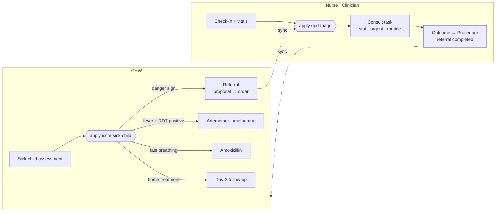

# Workflow Examples

A Kotlin Multiplatform app that shows [`dev.ohs.fhir:fhir-workflow`](https://github.com/ohs-foundation/kotlin-fhir-workflow) running two real-world workflows in one app. A community health worker (CHW) assesses a sick child with WHO/UNICEF iCCM and refers the child to the facility. At the facility, the nurse checks the child in, OPD triage queues them, and the clinician closes the referral. Each clinical decision comes from a FHIRPath `PlanDefinition` applied with `FhirOperator.generateCarePlan`. The referral moves through the CPG `ActivityFlow`: proposal → order → perform. The app started from the `player-reference` template.



## Roles

The role is the `PractitionerRole.code` (system `http://ohs.dev/fhir/CodeSystem/app-role`) on the signed-in user's PractitionerRole. The app reads it from the gateway's `GET /api/practitioner-details`.

| Role | Lands on | Does |
|---|---|---|
| `chw` | Patients · Follow-ups · Referrals | Registers children, runs the sick-child assessment, confirms referrals, closes day-3 follow-ups, and sees each referral as *Waiting at facility* or *Seen at facility* |
| `nurse` | Patients | Registers patients and checks them in with vitals, which runs OPD triage |
| `clinician` | OPD queue | Works the queue most urgent first, and completes consults with an outcome, which closes any referral behind them |

A user with no known role sees a "No role assigned" screen and does not sync. Several users can share one device, and their data is kept together in one local store. A new sign-in starts a full download for that user.

## Protocols

All protocol content ships in [`files/protocols/`](./workflow-examples/src/commonMain/composeResources/files/protocols). It is resolved in memory and never written to the local database. A write there would be queued for upload, and the gateway refuses `PlanDefinition`.

| PlanDefinition | Variables | Produces |
|---|---|---|
| `iccm-sick-child` | `%assessment`: the assessment response | `ServiceRequest` referral (SNOMED 3457005, urgent) on any danger sign. Otherwise, `MedicationRequest` for malaria or fast breathing, plus a follow-up `Task` |
| `opd-triage` | `%vitals`, `%referrals` | One `opd-consult` `Task` whose `priority` is `stat` if SpO₂ < 90 or the referral is urgent, `urgent` for any other referral, and `routine` otherwise |

The library has no CQL, so every condition is FHIRPath over data the app looks up first and passes in as `Bundle`s. To change clinical logic, edit the JSON. The tests in `IccmSickChildTest` and `OpdTriageTest` pin each branch.

## Sync

Each role downloads what [`files/sync/<role>.json`](./workflow-examples/src/commonMain/composeResources/files/sync) names. Each entry has a resource `type`, search `params`, and `ids`. `{practitioner}`, `{organization}` and `{location}` are filled in from the user's PractitionerRole.

```json
{ "type": "Task", "params": { "owner": "Practitioner/{practitioner}", "status": "requested" } }
```

The gateway runs `org_scoped_access` (ohs-player-reference-backend PR #82). It adds the organization filter to every search, so configs only narrow by role. `SyncConfigFilesTest` fails if a config names a type or param the gateway refuses.

## Setup

| Step | |
|---|---|
| JDK | 21. Gradle rejects JDK 25, so set `JAVA_HOME` if 25 is your default. |
| `local.properties` | `cp local.properties.sample local.properties`, then set `OAUTH_ISSUER`, `OAUTH_CLIENT_ID` and `FHIR_BASE_URL`. The redirect scheme defaults to `dev.ohs.player.reference.app`, the value already registered on the shared Keycloak client. |
| Gateway | It must allow `PATCH`. The engine sends every update (referral confirmed, referral completed, task closed) as `PATCH`, and PR #82's checker currently denies it. |
| Demo users | `cp scripts/seed.env.sample scripts/seed.env`, fill it in, then run `./scripts/seed.sh`. The script needs a confidential Keycloak client with `manage-users` and `manage-realm`. It creates `chw1`, `nurse1` and `clinician1` with passwords `chw_1234!`, `nurse_1234!` and `clinician_1234!`, together with only what they need to sign in and sync: their Practitioners and PractitionerRoles, one facility Organization and its OPD Location. It creates no patients or clinical data. It writes through the FHIR gateway, so it gives its own service account `ORG_SCOPE_EXEMPT` and the `GET_`/`PUT_` roles. You can run it again safely. |

## Run

| Target | Command |
|---|---|
| Desktop | `./gradlew :workflow-examples:run` |
| Android | `./gradlew :workflow-examples:assembleDebug` |
| Web (Wasm) | `./gradlew :workflow-examples:wasmJsBrowserDevelopmentRun` |
| iOS | Open [`iosApp/`](./iosApp) in Xcode |

## Walkthrough

1. Sign in as **chw1**. Tap **+** to register *Amina Otieno*, a child born 14 months ago, then open her and choose *Sick-child assessment*. Answer *Chest indrawing* = yes, then submit. The result says *Refer urgently to the health facility*. Choose **Confirm referral**, then sync.
2. Sign in as **nurse1**. Open *Amina* and choose *Check in to OPD*, entering SpO₂ 95. The app shows *Queued for consultation: stat*, because the referral is urgent. Sync.
3. Sign in as **clinician1**. *Amina* is at the top of the OPD queue, marked *Community referral*. Open her entry, enter an outcome, and choose **Complete**. Sync.
4. Sign in as **chw1** and sync. Under *Referrals*, Amina now shows *Seen at facility*.

To see the home-treatment path, register a second child, then assess them with fever and a positive RDT. The result lists artemether-lumefantrine and a day-3 follow-up, which then appears under *Follow-ups*.

## Tests

```shell
./gradlew :workflow-examples:jvmTest
```

| Area | Tests |
|---|---|
| Protocol branches | `IccmSickChildTest` (9 cases), `OpdTriageTest` (5 cases) |
| Referral loop on a real engine | `ProtocolServiceTest` |
| Roles and sync | `UserContextTest`, `PractitionerDetailsApiTest`, `SyncConfigResolverTest`, `SyncConfigFilesTest`, `RoleDownloadWorkManagerTest` |
| Screens | `AssessmentResultContentTest`, `WorklistContentTest`, `QueueContentTest`, `NoRoleScreenTest` |

## Not in this example

Households, pre-referral treatment, ANC, immunisation, stock, CQL and indicators, lab and pharmacy roles, and per-user data isolation on a shared device. The patient list and header still use the template's view-config pipeline (`ViewDefinition` → ig-codegen → `ViewRegistry`). See the `player-reference` README for that pipeline.
